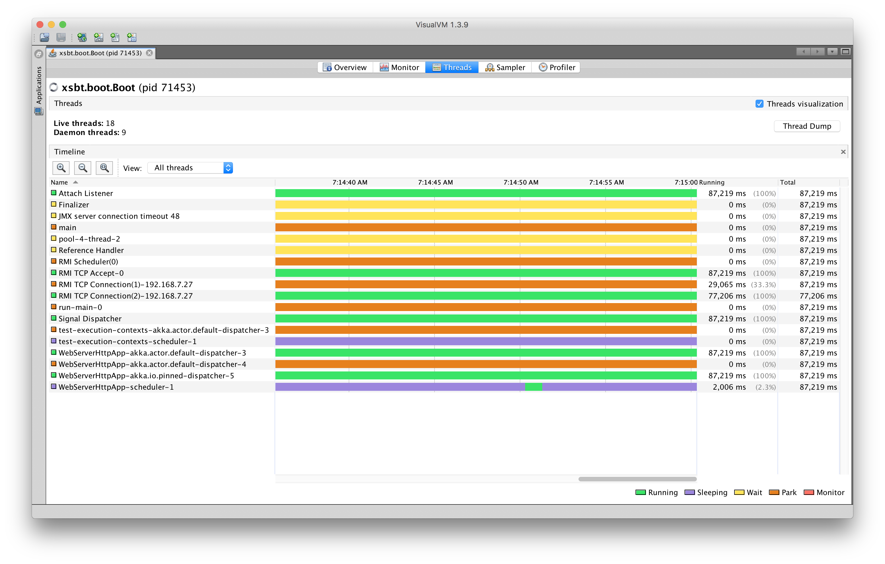
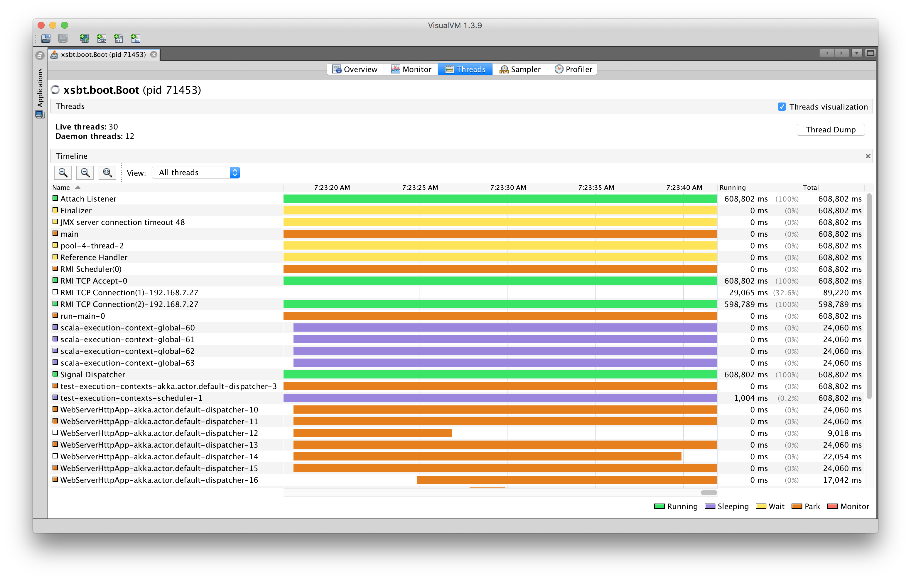
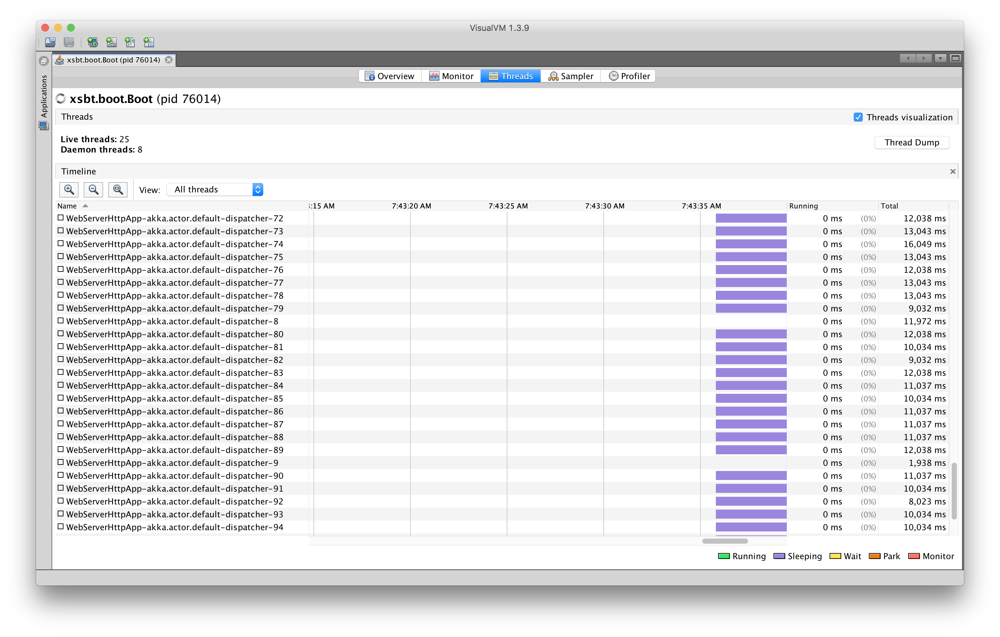
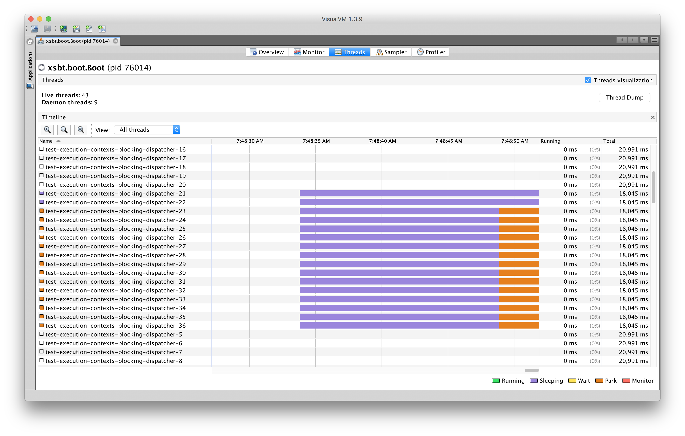

# test-execution-contexts

A small Akka HTTP project to experiment with different approaches for dealing with blocking operations.

- A vanilla `Future` that makes use of `scala.concurrent.ExecutionContext.Implicits.global`
- A `blocking` block, which makes use of the Akka HTTP `default-dispatcher`
- A vanilla `Future` that makes use of a custom dispatcher (`blocking-dispatcher`)

## Setup

First, launch the web application locally with `sbt`:

```bash
$ sbt run
[info] Loading project definition from /Users/hector/Desktop/test-execution-contexts/project
[info] Set current project to test-execution-contexts (in build file:/Users/hector/Desktop/test-execution-contexts/)
[info] Running com.azavea.WebServerHttpApp 
[DEBUG] [07/20/2017 07:12:19.368] [run-main-0] [EventStream(akka://test-execution-contexts)] logger log1-Logging$DefaultLogger started
[DEBUG] [07/20/2017 07:12:19.370] [run-main-0] [EventStream(akka://test-execution-contexts)] Default Loggers started
[DEBUG] [07/20/2017 07:12:19.654] [run-main-0] [EventStream(akka://WebServerHttpApp)] logger log1-Logging$DefaultLogger started
[DEBUG] [07/20/2017 07:12:19.654] [run-main-0] [EventStream(akka://WebServerHttpApp)] Default Loggers started
[DEBUG] [07/20/2017 07:12:19.716] [run-main-0] [AkkaSSLConfig(akka://WebServerHttpApp)] Initializing AkkaSSLConfig extension...
[DEBUG] [07/20/2017 07:12:19.719] [run-main-0] [AkkaSSLConfig(akka://WebServerHttpApp)] buildHostnameVerifier: created hostname verifier: com.typesafe.sslconfig.ssl.DefaultHostnameVerifier@3fd05a78
[DEBUG] [07/20/2017 07:12:20.464] [WebServerHttpApp-akka.actor.default-dispatcher-2] [akka://WebServerHttpApp/system/IO-TCP/selectors/$a/0] Successfully bound to /127.0.0.1:8080
[INFO] [07/20/2017 07:12:20.483] [WebServerHttpApp-akka.actor.default-dispatcher-3] [akka.actor.ActorSystemImpl(WebServerHttpApp)] Server online at http://localhost:8080/
Press RETURN to stop...
```

Next, launch VisualVM and locate the JVM assocatiated with `xsbt.boot.Boot`. Open that application and navigate to the **Threads** tab:



Lastly, open a new terminal window to execute `ab` against the routes associated with the three techniques for dealing with blocking operations:

```bash
$ ab -n 50 -c 50 http://127.0.0.1:8080/global
$ ab -n 50 -c 50 http://127.0.0.1:8080/default-dispatcher
$ ab -n 50 -c 50 http://127.0.0.1:8080/blocking-dispatcher
```

## Analysis

### Global Execution Context

By default, the `scala.concurrent.ExecutionContext.Implicits.global` execution context is bound by the number of available CPUs (**4** in my case). As you can see from the VisualVM output (purple bars), when throwing **50** concurrent connections at the Akka HTTP service, only **4** threads attempt to execute the blocking operations:



This leads to **34/50** failed requests due to timeouts as subsequent requests are queued:

```bash
Server Software:        akka-http/10.0.9    
Server Hostname:        127.0.0.1           
Server Port:            8080                

Document Path:          /global             
Document Length:        13 bytes            

Concurrency Level:      50                  
Time taken for tests:   20.397 seconds      
Complete requests:      50                  
Failed requests:        34                  
   (Connect: 0, Receive: 0, Length: 34, Exceptions: 0)                                   
Non-2xx responses:      34                  
Total transferred:      12490 bytes         
HTML transferred:       3778 bytes          
Requests per second:    2.45 [#/sec] (mean) 
Time per request:       20396.570 [ms] (mean)                                            
Time per request:       407.931 [ms] (mean, across all concurrent requests)              
Transfer rate:          0.60 [Kbytes/sec] received
```

### `blocking` (Default Dispatcher)

The `blocking` block uses theads from the Akka HTTP `default-dispatcher` to execute blocking operations (same thread pool used to handle incoming Akka HTTP connections). Here, VisualVM shows that new threads are spun up to handle the each of the **50** concurrent connections.



This leads to **50/50** request successes within **~5** seconds (the fixed duration of the blocking operation):

```bash
Server Software:        akka-http/10.0.9
Server Hostname:        127.0.0.1
Server Port:            8080

Document Path:          /default-dispatcher
Document Length:        13 bytes

Concurrency Level:      50
Time taken for tests:   5.224 seconds
Complete requests:      50
Failed requests:        0
Total transferred:      8750 bytes
HTML transferred:       650 bytes
Requests per second:    9.57 [#/sec] (mean)
Time per request:       5224.353 [ms] (mean)
Time per request:       104.487 [ms] (mean, across all concurrent requests)
Transfer rate:          1.64 [Kbytes/sec] received
```

### Custom Dispatcher

A `Future` with a custom dispatcher applied implicitly makes use of the custom dispatcher's thread pool. In this case, the thread pool for the custom `blocking-dispatcher` was defined as:

```scala
blocking-dispatcher {
  type = Dispatcher
  executor = "thread-pool-executor"
  thread-pool-executor {
    fixed-pool-size = 16
  }
  throughput = 1
}
```

Here, VisualVM shows that new threads are spun up to execute the blocking operation inside of the `blocking-dispatcher` thread pool:



This leads to **50/50** request successes within **~20** seconds because the thread pool size is fixed, and certain requests get queued as others are being serviced: 

```bash
Server Software:        akka-http/10.0.9
Server Hostname:        127.0.0.1
Server Port:            8080

Document Path:          /blocking-dispatcher
Document Length:        13 bytes

Concurrency Level:      50
Time taken for tests:   20.036 seconds
Complete requests:      50
Failed requests:        0
Total transferred:      8750 bytes
HTML transferred:       650 bytes
Requests per second:    2.50 [#/sec] (mean)
Time per request:       20035.555 [ms] (mean)
Time per request:       400.711 [ms] (mean, across all concurrent requests)
Transfer rate:          0.43 [Kbytes/sec] received
```